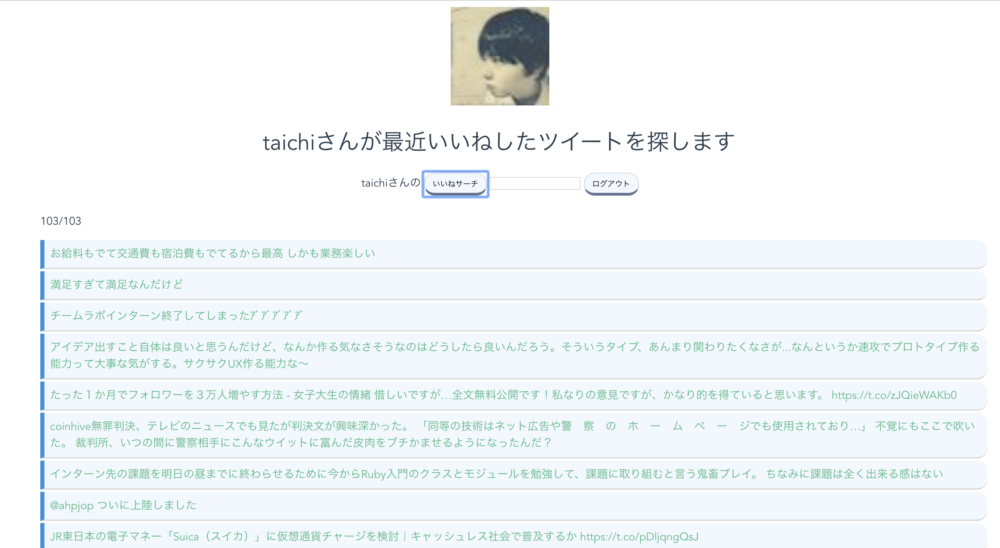

# flask_get_favorites

## アプリ画面


## 実行方法
```
python get_favorites.py
```

## 詳細
- user_idが現状固定されているので、引数として変更できるようにしてください
- CONSUMER_kEYなどを自分のものに変えてください
- countの部分も自由に変えてください
- top.htmlに結果が反映されるようにしています。
